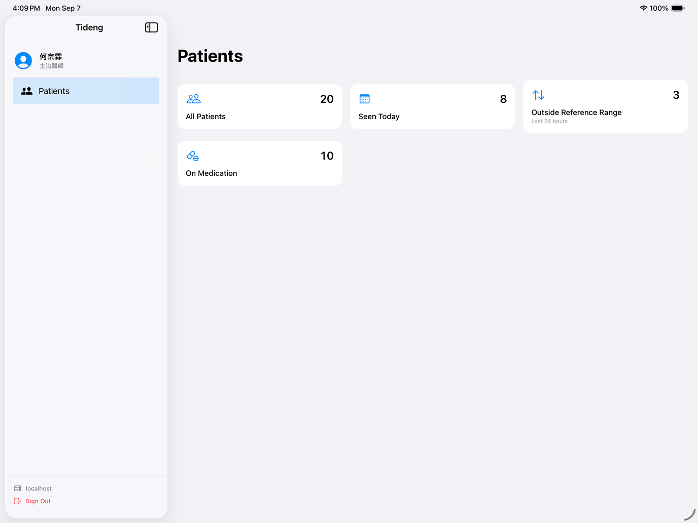
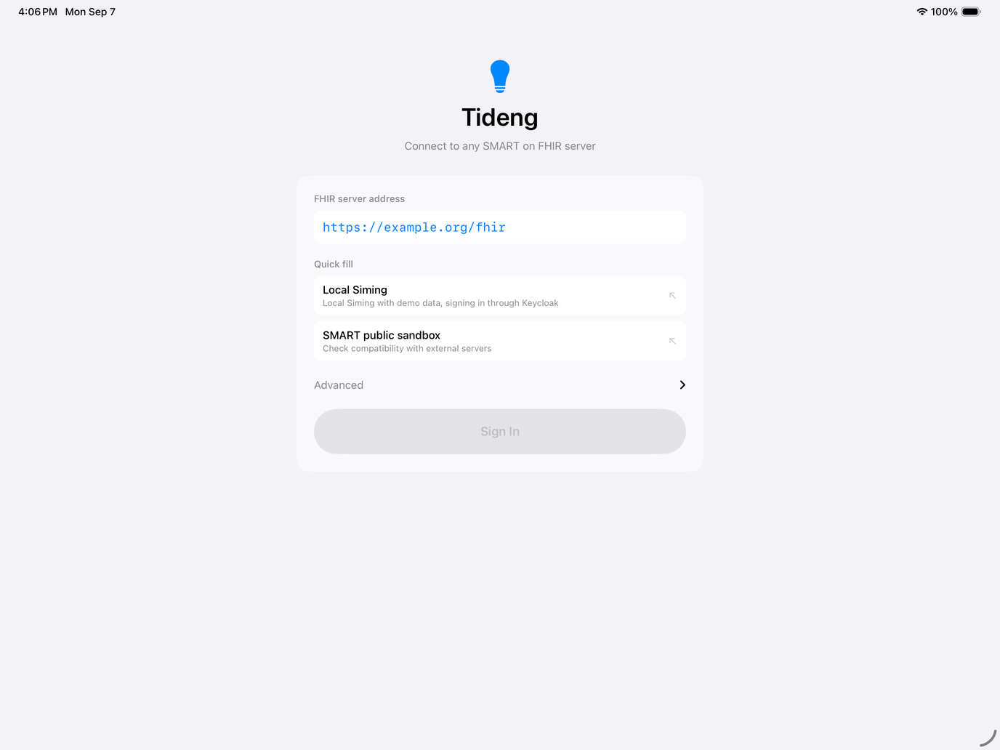

English · [繁體中文](README.zh-Hant.md)

# Tideng

An iPad client for SMART on FHIR servers.



## Signing in

Three ways in:

1. **Type a base URL** — any server that supports SMART on FHIR.
2. **Local Siming** — the environment bundled with this project: Siming as the FHIR server,
   Keycloak as the authorization server, with demo data. Use this for development and demos.
3. **SMART public sandbox** — points at `launch.smarthealthit.org`, the public test environment.

The last two only fill the base URL in for you; the flow is identical.



## FHIR resources implemented

FHIR R4 defines over a hundred resources. This implements the ones a clinical browsing flow
needs. Read-only.

- **`Patient`** — patient list and record
- **`Encounter`** — visit status, times and participants
- **`MedicationRequest`** — prescriptions and dosage instructions
- **`Observation`** — vital sign trends
- **`Practitioner`** / **`PractitionerRole`** — the signed-in user, encounter participants,
  prescribers

## Running it

### App

Needs Xcode 26 and [XcodeGen](https://github.com/yonaskolb/XcodeGen).

```bash
cd App && xcodegen generate && open Tideng.xcodeproj
```

Pick **SMART public sandbox** on the sign-in screen and it runs — no local server needed.

### Local FHIR server (optional)

Only needed if you want the demo data. Requires Docker and the
[Siming](https://github.com/shinrenpan/Siming) source (the FHIR server — docker-compose builds
its image from source, so Docker alone is not enough).

Siming goes next to Tideng:

```
your-folder/
├── Tideng/
└── Siming/
```

```bash
git clone https://github.com/shinrenpan/Siming.git

cd Tideng/Server && docker-compose up -d   # Keycloak + Siming + Postgres
cd seed && swift run SimingSeed            # 20 patients, 8 encounters, 308 observations, 10 prescriptions
```

Anywhere else works too — point `SIMING_PATH` at it.

In the app, tap **Local Siming** or type `http://localhost:8080`. Username `ho`, password `tideng`.

The demo data is all generated, the accounts belong to fictional practitioners, and none of it
is real patient data.

## Built with

### App

- **Swift 6**, strict concurrency
- **SwiftUI** + Swift Charts, iPad only
- **[MVVMC](https://github.com/shinrenpan/MVVMC)** — a custom architecture: one directory per
  feature, with defined responsibilities for each of the M / V / VM / C layers
- **FHIR R4** — [apple/FHIRModels](https://github.com/apple/FHIRModels) pinned to `0.9.3`
- **SMART App Launch v2** — standalone launch, PKCE, `offline_access`, RS256 `id_token`
  signature verification
- **218 tests** — app 112, FHIRCore 37, FHIRClient 25, SmartAuth 44

The three local SPM packages depend in one direction only: `SmartAuth → FHIRClient`.
`FHIRClient` takes a `TokenProviding` and knows nothing about auth.

### Server

- **[Siming](https://github.com/shinrenpan/Siming)** — FHIR R4 server; it verifies tokens, it
  does not issue them
- **Keycloak 26** — authorization server, realm configured from an import file
- **PostgreSQL 16**
- **docker-compose** — three containers, one command
- **seed** — a Swift executable that shares the app's `FHIRCore` to generate the demo data

## Layout

```
App/        the iPad app and three local packages
Server/     local development environment (docker-compose) and the demo data seed
openspec/   specs and change history, from Claude Code + Spectra
```

Built with [Spectra](https://github.com/kaochenlong/spectra-app) for spec-driven development:
the proposal and design come first, implementation follows, and archiving merges the spec into
`openspec/specs/`. So `openspec/specs/` is the current state and `openspec/changes/archive/`
holds the reasoning behind each change.
