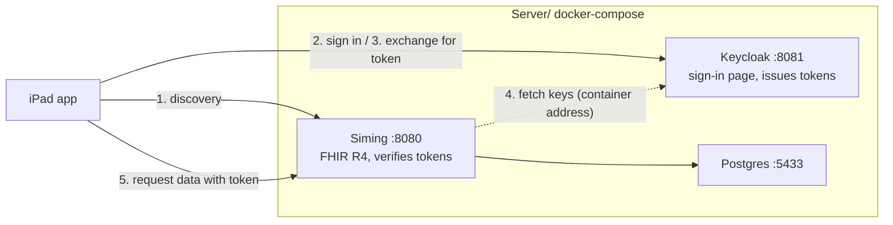

English · [繁體中文](README.zh-Hant.md)

# Local development environment

The environment Tideng is developed against. Three containers: Siming as the FHIR server,
Keycloak as the authorization server, Postgres for Siming's data.

For how to start it, see [the root README](../README.md#local-fhir-server-optional). This file
covers why it is put together this way, and where to look when something breaks.

Siming's source lives in [its own repo](https://github.com/shinrenpan/Siming); only the setup
for running it lives here.

## Architecture



Siming verifies tokens, Keycloak issues them. The two roles do not overlap, which is how a real
deployment is arranged.

The app never sees the password: step 2 happens in the system browser.

The seed runs on the host rather than in a container because it uses `App/Packages/FHIRCore`.

## Accounts

Four practitioners, all with the password `tideng` (development only, change it for any real
deployment):

| Username | Name | Role | Bound to |
|---|---|---|---|
| `ho` | 何宗霖 | Doctor | `Practitioner/practitioner-1` |
| `chien` | 簡怡君 | Nurse | `Practitioner/practitioner-2` |
| `chiu` | 邱承翰 | Doctor | `Practitioner/practitioner-3` |
| `kang` | 康雅琳 | Nurse | `Practitioner/practitioner-4` |

The binding is a Keycloak user attribute that becomes the `fhirUser` claim on the `id_token`.
Practitioner ids are assigned by the seed, so the binding survives a reload of the demo data.

## Three addresses that must not be mixed up

"Where Keycloak is" resolves differently depending on who is asking:

| Variable | Used by | Must be reachable from | Symptom when wrong |
|---|---|---|---|
| `SMART_ISSUER` | Siming, to compare the token's `iss`; also what the app's browser opens | outside | every request 401s after signing in |
| `SMART_JWKS_URL` | Siming, to fetch signing keys | inside the container network | Siming fails to start |
| `SMART_AUDIENCE` | Siming, to compare the token's `aud` | byte-identical to the `aud` the app sends | sign-in succeeds, every request 401s |

The `aud` comparison is exact string equality. `http://localhost:8080` and
`http://localhost:8080/` are two different values, and one trailing slash means you can sign in
but read nothing.

## Restart Siming after restarting Keycloak

Keycloak runs on an embedded database and generates new signing keys whenever the container is
rebuilt. Siming fetches the public keys once at startup, so it still holds the old ones:

```
Token verification failed        ← the token is fine; the key that signed it changed
```

```bash
docker-compose restart siming
```

Signed-in app sessions are invalidated too, so sign in again.

## Where the configuration lives

`keycloak/tideng-realm.json` is the only source. The container re-imports it on every start,
so anything changed through the admin console is gone by the next start.

The filename has to end in `-realm.json`. If it does not, Keycloak prints
`Import finished successfully` and imports zero realms.

The import file does not support `${env.X}` substitution. The audience is the only
host-dependent value, so it sits in the file as `@SMART_AUDIENCE@` and compose substitutes it
at startup.

## Verify the image after building

```bash
./verify-image.sh
```

Siming's FHIR definition packages (`packages/*.tgz`) are gitignored. Building from a clean clone
leaves that directory empty, and the server still starts, still answers `/health` with 200, and
only the terminology is missing. This script checks the size of the CapabilityStatement: around
76 KB when complete, 11 KB without terminology.
