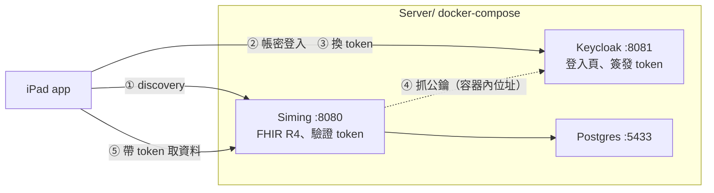

[English](README.md) · 繁體中文

# 本地開發環境

Tideng 開發用的環境。三個 container：Siming 當 FHIR 伺服器、Keycloak 當授權伺服器、
Postgres 存 Siming 的資料。

怎麼起動看[根目錄的 README](../README.zh-Hant.md#本地-fhir-伺服器選用)。這份講的是它為什麼
長這樣，以及卡住時該看哪裡。

Siming 的原始碼在[自己的 repo](https://github.com/shinrenpan/Siming)，這裡只放怎麼把它跑起來。

## 架構



Siming 只驗證 token，Keycloak 只簽發 token。兩邊的職責不重疊，跟真實部署一樣。

app 全程看不到密碼：② 是在系統瀏覽器裡輸入的。

seed 跑在 host 而不是容器裡，因為它要用 `App/Packages/FHIRCore`。

## 帳號

四位醫事人員，密碼都是 `tideng`（開發用，正式部署要換掉）：

| 帳號 | 姓名 | 職位 | 綁定 |
|---|---|---|---|
| `ho` | 何宗霖 | 主治醫師 | `Practitioner/practitioner-1` |
| `chien` | 簡怡君 | 護理師 | `Practitioner/practitioner-2` |
| `chiu` | 邱承翰 | 主治醫師 | `Practitioner/practitioner-3` |
| `kang` | 康雅琳 | 護理師 | `Practitioner/practitioner-4` |

綁定走 Keycloak 的使用者屬性，變成 `id_token` 的 `fhirUser` claim。Practitioner 的 id 由
seed 指定，所以重灌資料之後綁定還在。

## 三個位址不能混用

同一個「Keycloak 在哪」，在不同角色眼中是不同的位址：

| 變數 | 誰在用 | 要填誰看得到的位址 | 填錯會怎樣 |
|---|---|---|---|
| `SMART_ISSUER` | Siming 比對 token 的 `iss`，也是 app 瀏覽器要連的 | 對外 | 登入後每個請求 401 |
| `SMART_JWKS_URL` | Siming 自己抓公鑰 | 容器內 | Siming 啟動失敗 |
| `SMART_AUDIENCE` | Siming 比對 token 的 `aud` | 與 app 送出的 `aud` 逐字元相同 | 登入成功但每個請求 401 |

`aud` 的比對是完全字串相等，`http://localhost:8080` 和 `http://localhost:8080/` 是兩個值。
多一個尾斜線就是登入得進去、但什麼都讀不到。

## 重啟 Keycloak 之後要重啟 Siming

Keycloak 用內嵌資料庫，重建容器就重新產生簽章金鑰。Siming 的公鑰是啟動時抓一次的，
於是它手上還是舊的：

```
Token verification failed        ← token 沒問題，是簽它的金鑰換了
```

```bash
docker-compose restart siming
```

已登入的 app session 也會失效，要重新登入。

## 設定改哪裡

`keycloak/tideng-realm.json` 是唯一來源。容器每次啟動重新匯入，所以從管理介面改的東西
下次啟動就沒了。

檔名必須以 `-realm.json` 結尾。不符合的話 Keycloak 會印 `Import finished successfully`，
然後匯入零個 realm。

匯入檔不支援 `${env.X}` 替換，唯一跟主機有關的 audience 用 `@SMART_AUDIENCE@` 佔位，
由 compose 在啟動前換掉。

## 建完記得驗

```bash
./verify-image.sh
```

Siming 的 FHIR 定義檔（`packages/*.tgz`）是 gitignored。從乾淨的 clone 建置會得到空的
packages 目錄，而 server 照樣啟動、`/health` 照樣回 200，只有 terminology 是空的。
這支腳本檢查 CapabilityStatement 的長度，正常約 76KB，缺 terminology 時只剩 11KB。
